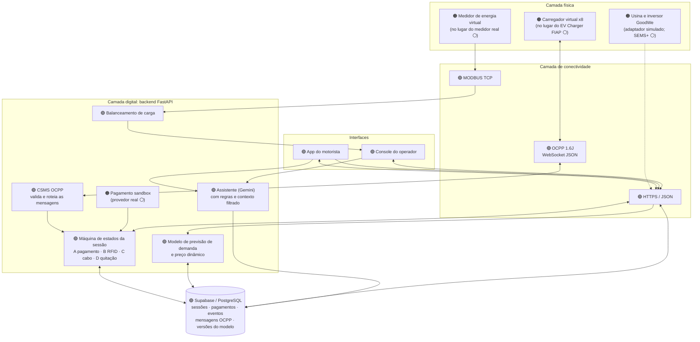
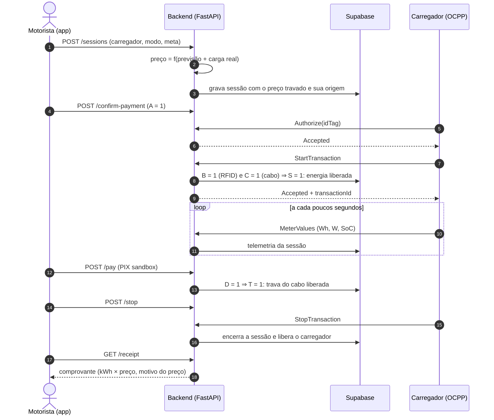
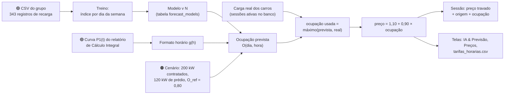
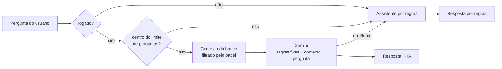

# Fluxo de dados do ChargeGrid

Entregável **"Arquitetura Funcional: lógica clara de entradas e saídas de dados (Data Flow)"** do EV Challenge 2026.
Os diagramas abrem direto no GitHub (Mermaid). Cada caixa diz o que é **real**, **simulado** ou **futuro**.

Legenda: 🟢 real (roda de verdade neste projeto) · 🟠 simulado (imita o equipamento, com o protocolo real) · ⚪ futuro (depende de acesso/equipamento que ainda não temos).

---

## 1. Visão geral: a arquitetura híbrida

**Regra de ouro:** o navegador nunca fala com o Supabase. Só o backend acessa o banco, e segredos (senha do banco, chave do Gemini, credenciais da GoodWe) existem apenas no backend.

---

## 2. Fluxo 1: uma sessão de recarga, ponta a ponta

| Etapa | Entrada | Processamento | Saída |
|---|---|---|---|
| Criar sessão | carregador, modo, meta de bateria, veículo | reserva o carregador, calcula o preço (fluxo 2) | sessão com preço travado |
| Pré-autorizar pagamento (A) | ação do motorista | FSM marca A = 1 | evento `payment_confirmed` |
| Authorize / StartTransaction | `idTag` do motorista, medidor inicial | confere motorista e sessão; FSM marca B e C | energia liberada (S = A·B·C) |
| MeterValues | Wh, W, SoC | atualiza energia, potência e % da sessão | telemetria para app e console |
| Pagamento (D) | método (PIX/cartão) | provedor devolve aprovado/pendente/recusado | trava liberada só se aprovado (T = A·B·C·D) |
| Encerrar | pedido do app + StopTransaction | fecha a sessão e libera o carregador | comprovante |

Fórmulas do docx da Sprint 3, implementadas em `backend/app/services/session_fsm.py`: `S = A·B·C + M` (energia) e `T = A·B·C·D + M` (trava), onde `M` é o bypass de manutenção do operador.

---

## 3. Fluxo 2: previsão de demanda e preço dinâmico

Detalhes e números em [`MODELO_PREVISAO.md`](MODELO_PREVISAO.md).

---

## 4. Fluxo 3: energia do local e balanceamento

| Etapa | Entrada | Saída |
|---|---|---|
| Medidor virtual | curva do prédio + carga dos carros (banco) | registradores MODBUS (float32 em 2 registradores) |
| Leitor MODBUS | leitura pela rede (`pymodbus`) | última leitura + idade |
| Balanceamento | leitura do medidor (se recente) ou cenário de referência | solar/rede/bateria/carga e limite de importação |
| Console | `/billing/balancing`, `/ops/meter` | cartão "Medidor de energia" e painel de balanceamento |

Se o medidor estiver desligado ou a leitura passar de 10 s, o balanceamento volta sozinho para o cenário de referência (120 kW), e a tela informa a origem (`modbus` ou `cenario`).

---

## 5. Fluxo 4: assistente de IA

**O que sai para o Gemini:** regras do assistente, um resumo do banco filtrado pelo papel (motorista vê só as próprias sessões; operador vê agregados e nomes abreviados), a previsão do dia e a pergunta. **Nunca sai:** e-mails, senhas, tokens, números de série, dados de outros usuários.

---

## 6. Real × simulado × futuro

| Componente | Situação | Como é identificado no sistema |
|---|---|---|
| API, banco (Supabase), autenticação, máquina de estados, comprovantes, auditoria | 🟢 real | `/health` mostra o motor do banco |
| Protocolo OCPP 1.6J (servidor, validação, log de mensagens) | 🟢 real | tela **Logs OCPP** com mensagens do banco |
| Carregador | 🟠 virtual (fala OCPP de verdade) | `ocpp.simulator` no `/health`; "Virtuais (simulados)" na tela |
| Protocolo MODBUS TCP (servidor e leitor) | 🟢 real | validado contra o cliente `pymodbus` |
| Medidor de energia | 🟠 virtual; mapa de registradores **assumido** | selo "Simulado" no cartão do medidor |
| Modelo de previsão e preço | 🟢 real, calibrado com o CSV do grupo | versão, fonte e nº de registros na tela |
| Nível de ocupação (0,80) e capacidade (80 kW) | 🟠 suposição de cenário | descrito em `MODELO_PREVISAO.md` |
| Pagamento | 🟠 sandbox; troca por provedor real é uma classe | `origem: sandbox` no comprovante e `/health` |
| Telemetria GoodWe | 🟠 adaptador simulado | campo `origem` e selo "Dados simulados" |
| Assistente com IA | 🟢 real (Gemini) com reserva por regras | selo "Resposta gerada por IA" |
| Carregador FIAP físico | ⚪ futuro | mesmo protocolo: só muda o endereço |
| GoodWe OpenAPI real | ⚪ futuro (depende de credenciais) | adaptador real é um esqueleto ainda não validado |
| Pagamento real | ⚪ futuro | `services/payments.py` |
